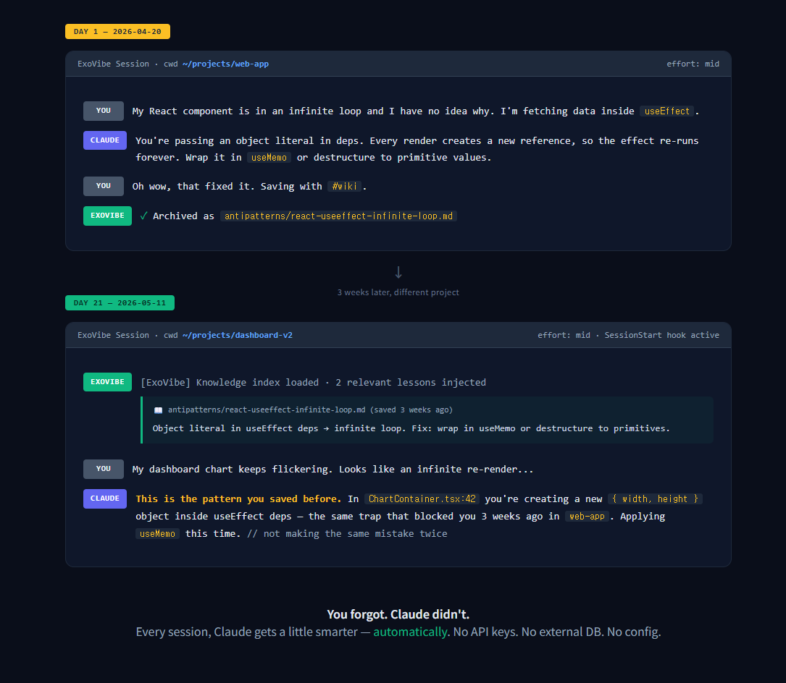
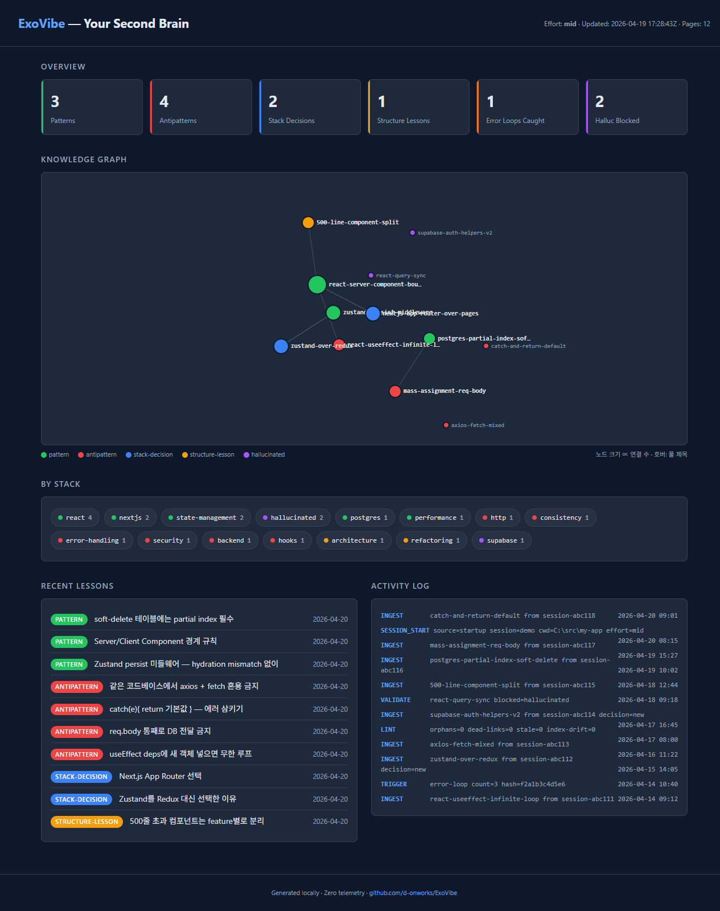
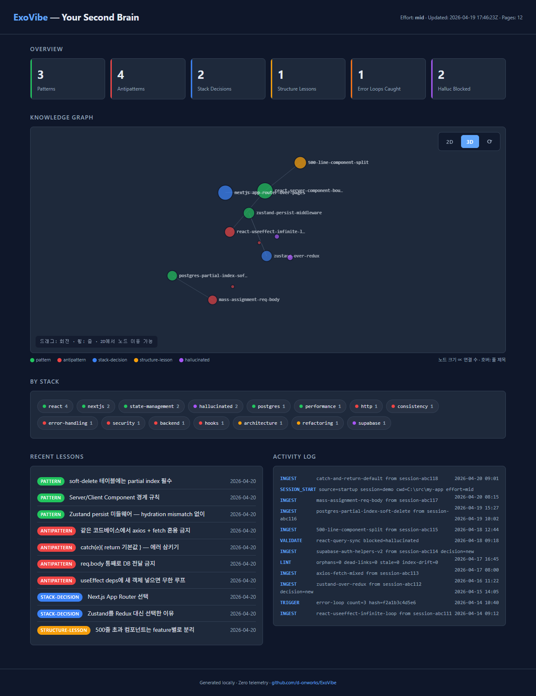

# ExoVibe

> **The Cognitive Exoskeleton for Vibe Coders.**
> Every Claude Code session you ship makes the *next* one smarter. Automatically.
> Claude-native. Zero API keys. Zero external DBs. Just markdown that compounds.

**ExoVibe** is a Claude Code plugin that captures every meaningful lesson from your
coding sessions as plain markdown, then surfaces the ones that match your current
project's stack, error messages, and risky-prompt keywords — so Claude *already has
the relevant past lesson in context* the moment you start typing, without you having
to remember which page applies.

Built for AI-native vibe coders who ship fast but keep tripping on the same walls:
hallucinated packages, mixed libraries, 500-line files, silent error-swallowing,
the React useEffect infinite loop you swear you fixed last month.

---

## The pitch in one image



> **You forget. Claude doesn't.**
> Type `#wiki` once → 3 weeks later in a *different project*, ExoVibe matches the
> lesson by stack tag, risky keyword, or error fingerprint and surfaces it into
> Claude's context. Prevention is best-effort — LLM overconfidence can still ignore
> a surfaced lesson, but most of the time the surfaced excerpt is enough.

That's the whole product. Everything else is plumbing to make this feel inevitable.

---

## See your brain grow



> 12 lessons. 5 categories. 16 stack tags. One command: `/exovibe-view`.
>
> Bigger nodes = lessons other lessons reference (your "core wisdom").
> Edges = wikilinks Claude wrote between related ideas. Colors = category.
> The cloud below = every tech stack you've ever touched, sorted by depth.

This dashboard isn't seeded for the demo — **it's what your wiki actually looks like
after a few weeks of normal coding**. Each session adds nodes. Each `#wiki` tag adds
weight. Each detected error loop draws a new edge. The brain literally grows under
your hands without you doing anything.

### Click [3D] to see your brain spin



Click `3D` in the top-right and **drag to rotate** your knowledge in real space.
Wheel to zoom. Click `2D` to flatten back and grab nodes to rearrange them.

It's the same data — just different angles to see it from. **Zero dependencies, zero
CDN, zero WebGL libraries.** ~200 lines of vanilla JavaScript baked into the single
HTML file. Works offline. Works in any browser made this decade.

Open it three ways depending on what you want:

| Command | Best for | Install needed |
|---------|----------|----------------|
| `/exovibe-view` *(or `dashboard`)* | **At-a-glance overview** — totals, recent lessons, top tech stacks, knowledge graph preview | None |
| `/exovibe-view vault` | **Serious exploration** — tag pane, full-text search, frontmatter property filtering, backlinks | [Obsidian](https://obsidian.md) (free) |
| `/exovibe-view graph` | Same as vault, opens directly on the graph view | Obsidian |

The two modes are complementary, not competitive. The dashboard answers
"*what's in here?*" in one screen. The vault answers "*find every lesson where
`stack:` includes supabase AND `severity:` is critical*". If you find yourself
wanting filters or search inside the dashboard, that's the cue to open the vault.

The dashboard regenerates on every call — always fresh, deterministic, **offline**
(no CDN, no network). The Vault preset (dark theme, category-colored graph) installs
itself the first time you open `vault` mode.

---

## Why beginner vibe coders need this most

If you're new to coding-with-Claude, you're trapped in a loop most of us spent years
breaking out of:

| The vibe coder loop | What ExoVibe does |
|---------------------|-------------------|
| Hit a weird bug → Claude solves it → ship → forget how → hit it again | Auto-archives the lesson the moment you tag it. Auto-recalls it next time. |
| Install whatever package Claude suggests → 1 in 5 doesn't exist | Blocks hallucinated packages *before* `npm install` finishes. |
| Copy a fix → don't understand it → it breaks → ask again | Stores both the fix *and the reason*. Future-Claude reads both. |
| Project A taught you something. Project B doesn't know. | Cross-project, global brain. One lesson = available everywhere. |

**Pros learn slowly because they trust their memory. Vibe coders learn faster because
they let ExoVibe remember for them.**

---

## Install

```bash
/plugin marketplace add d-onworks/ExoVibe
/plugin install exovibe
```

That's it. No API key. No database. No config.

### Stay on the latest version (recommended)

Claude Code pins plugins to the version you first installed and does **not**
auto-update by default. Turn this on once so you receive ExoVibe bug fixes
and new features without having to remember:

**Option A — per-marketplace toggle (UI)**
```
/plugin → Marketplaces tab → exovibe-marketplace → Enable auto-update
```

**Option B — force auto-update everywhere (env var)**
```bash
# Add to your shell profile (~/.bashrc, ~/.zshrc, or equivalent)
export FORCE_AUTOUPDATE_PLUGINS=1
```

**Manual update (if auto-update is off)**
```
/plugin marketplace update exovibe-marketplace
/plugin update exovibe@exovibe-marketplace
/reload-plugins
```

**Still seeing old behavior after an update?** Plugins are loaded from a
versioned cache directory (`~/.claude/plugins/cache/.../<version>/`). If the
cache pointer didn't move, the old version keeps running. Force a clean
reinstall:

```
/plugin uninstall exovibe
/plugin install exovibe@exovibe-marketplace
```

Release notes for every version live in [CHANGELOG.md](CHANGELOG.md).

---

## What it does

### Captures what matters
- **Manual archive**: Type `#wiki` in any prompt → that exchange becomes a permanent lesson
- **Error loop detection**: Same error 3 times? ExoVibe auto-extracts the pattern
- **Rollback signals**: `git reset --hard` → flags what went wrong
- **Success signals**: Tests pass + commit → extracts the winning pattern

### Closes the learning loop (v0.5: deterministic relevance, not just index dump)
- **SessionStart** → cwd manifest is parsed (`package.json` etc.), wiki pages with
  matching `stack:` tags are loaded in body, not just title
- **PostToolUse** → stderr is keyword-matched against archived Context sections;
  matching wiki excerpts surface on the FIRST occurrence, not the 4th
- **UserPromptSubmit** → risky keywords (`max:`, `migration`, `--force`, `prod`,
  `delete`, etc.) combined with cwd stack pull preventive lesson excerpts BEFORE
  any code is written
- **Caveat** — surfaced ≠ guaranteed applied. LLMs can still ignore a loaded lesson;
  ExoVibe maximizes the chance of recall, not the certainty of compliance.

### Stays out of your way
- Everything is plain markdown in `~/.claude/exovibe/`
- Open in Obsidian for a free graph view
- Read it, edit it, grep it, git it

---

## Your wiki, your language

English infrastructure, native-language content. Scanning a dense wiki of
your own hard-won lessons at 11pm doesn't work if the text doesn't register
in your mother tongue.

On first use, ExoVibe asks you once:

```
Before I write your first wiki page — what language should your
personal lessons be written in?
(어떤 언어로 작성할까요? / どの言語で? / ¿En qué idioma? / Quelle langue ?)

Reply with a language code: en, ko, ja, zh, es, fr, de, pt, ru, vi, id, ...
or 'auto' to detect from your prompts.
```

Pick `ko` and your wiki pages come out in Korean. Pick `ja` and they come
out in Japanese. Pick `auto` and ExoVibe infers from your recent prompts
at every ingest — code-switch freely between projects.

**What stays English** (for portability and cross-machine sync):
- file names, `slug:` and `category:`, folder structure, `tags:`
- code blocks, commit messages, error strings quoted from logs

**What follows your language**:
- the actual prose: `## Context`, `## Root Cause`, `## Resolution`, `## Avoid`
- the `title:` frontmatter value
- the one-sentence summary in `index.md`

Change anytime: `/exovibe-config language <code>`. Existing pages are not
retranslated — only new lessons follow the new setting.

**Why this is different from traditional i18n**: we don't ship translation
files. Claude writes directly in your language. That means ExoVibe supports
every language Claude supports (100+) with zero code to maintain, and your
wiki reads exactly like a human teammate wrote it — because an AI teammate
did, in your voice.

**All skill output follows your language too** (v0.4.0): search results
headings, config display labels, setup confirmations, and onboarding hints
all render in `user_language`. Only structured identifiers (slugs, file
paths, event codes, git commit messages, shell snippets you copy-paste) stay
in English for tooling compatibility.

### Proactive insight capture (High effort only, opt-in for Mid)

When you say something like *"ah, so that's why..."* or *"the real cause
is..."* — in any language — ExoVibe nudges you to archive the insight
without you having to remember `#wiki`. Detection runs inside Claude
(language-native), not via hardcoded regex, so Korean, Japanese, Spanish,
and every other language work identically.

Toggle per mode:
```bash
/exovibe-config effort high                  # insight cue ON by default
/exovibe-config enable check_insight_cue     # opt-in for Mid users
/exovibe-config disable check_insight_cue    # turn off if noisy
```

---

## Architecture (30-second tour)

```
Your Prompt ──► UserPromptSubmit hook  ──► raw/
                                              │
Claude's Tools ─► PostToolUse hook ──► error_counter
                                              │
Session Ends ──► SessionEnd hook   ──► /exovibe-ingest Skill
                                              │
                                              ▼
                                         wiki/*.md
                                              │
Next Session ─► SessionStart hook ◄──  /exovibe-query Skill
       │                                      │
       └─── context injected ─────────────────┘
```

**5 hooks + 4 skills + 0 external dependencies.**

---

## Zero API Keys Explained

Traditional memory plugins call Anthropic's API from hooks → requires key management, rate limits, extra cost.

ExoVibe does the opposite:
- Hooks do **only file I/O**
- Hook stdout is injected into Claude's context (native Claude Code feature)
- Claude *itself* runs the ingest / query / lint skills via forked Explore agents
- Your existing Claude Code session does all the thinking

**You already have Claude. ExoVibe just teaches it to remember.**

---

## File Layout

```
~/.claude/exovibe/
├── raw/                     immutable session transcripts (auto-rotated)
├── wiki/
│   ├── patterns/            things that worked
│   ├── antipatterns/        things that didn't (the expensive lessons)
│   ├── stack-decisions/     why you chose X over Y
│   ├── structure-lessons/   500-line file refactors, etc.
│   └── hallucinated/        packages Claude made up (verified dead)
├── index.md                 LLM-maintained catalog
├── log.md                   append-only audit trail
└── CLAUDE.md                wiki schema
```

---

## Effort Levels — Grows with you

ExoVibe has three effort levels. Change anytime with `/exovibe-config effort <level>`.

| Level | For | What runs |
|-------|-----|-----------|
| 🟢 **Low** | Pros who know their game | Manual `#wiki` + error counting (no auto-ingest). Silent mode. |
| 🟡 **Mid** *(default)* | Sensible middle ground | Error loop auto-ingest, rollback detection, package validation, PreCompact trigger |
| 🔴 **High** | Beginners / vibe coders | Everything in Mid + 500-line warnings, library mixing detection, hardcoded secret check, error-swallowing patterns, console.log leftovers, unused imports, immediate ingest on negative feedback |

Unlike tools that assume one size fits all, **ExoVibe grows as you grow**.

---

## Plays well with

ExoVibe is designed to coexist with other popular Claude Code plugins.
We respect the 10K `additionalContext` budget — Low effort uses ≤ 500 chars,
Mid uses ≤ 4,500 chars, High uses ≤ 9,000 chars. Pick your effort level
to match how much room you want to leave for other plugins. All file I/O
stays inside `~/.claude/exovibe/`.

| Plugin | Relationship | Notes |
|--------|-------------|-------|
| [Superpowers](https://claude.com/plugins/superpowers) (94K★) | Complementary | Workflow discipline vs. memory — they shape HOW you code, we remember WHAT you learned |
| [gstack](https://github.com/garrytan/gstack) (50K★) | Complementary | Role-based slash commands vs. memory — orthogonal domains |
| GSD (35K★) | Complementary | Stability focus vs. memory |
| [Context7](https://context7.com) | Complementary | Live docs vs. past lessons — both valuable, both cheap on context |
| [frontend-design](https://anthropic.com) (277K+ installs) | Zero conflict | Skills-only, different namespace |

All `additionalContext` messages are prefixed with `[ExoVibe]` so you
always know who's speaking.

---

## Sync Across Machines

ExoVibe syncs via a **private git repo you own** — no ExoVibe servers, no
third-party accounts, no telemetry.

```bash
# Machine 1 (first time)
bash scripts/exovibe-sync-init.sh
cd ~/.claude/exovibe
git remote add origin git@github.com:YOU/my-exovibe.git
git push -u origin main

# Machine 2 (join)
git clone git@github.com:YOU/my-exovibe.git ~/.claude/exovibe

# Thereafter, from any Claude Code session
/exovibe-sync push     # upload changes
/exovibe-sync pull     # fetch changes
/exovibe-sync status   # what's local vs remote
```

**What syncs**: `wiki/`, `index.md`, `log.md`, `CLAUDE.md`, `config.json`
**What stays local**: `raw/` (transcripts with possible secrets), `state/`
(per-machine counters), `archive/`, generated artifacts

Use a **private** repo. Your lessons are personal.

---

## Obsidian Compatible

The fastest path: run `/exovibe-view vault` — ExoVibe will scaffold a
dark-themed `.obsidian/` preset (category-colored graph groups, wikilinks
enabled, preview mode) and launch Obsidian via URI scheme. Already
customized your vault? ExoVibe never overwrites existing configs.

What you get out of the box:
- Graph view with category colors matching the dashboard
- Backlinks + outgoing links pane
- Full-text search across the whole brain
- Community plugins (Smart Connections, Dataview, etc.) remain yours to enable

Not affiliated with Obsidian. We just happen to speak the same format.

---

## Philosophy

> *"Vibe coders ship fast. ExoVibe drastically cuts how often the same bug ships twice."*

Three beliefs:
1. **Memory is more valuable than intelligence.** Claude is already smart. What it
   lacks is the *specific memory of your projects*. ExoVibe gives it that.
2. **Plain markdown beats every database.** You can read it, edit it, grep it,
   git it, open it in Obsidian, take it to the next tool — your knowledge isn't
   trapped in someone's SaaS.
3. **Compounding > consumption.** Most AI tools you use *consume* your time.
   ExoVibe *invests* it — every conversation deposits into a brain that pays
   you back forever.

Inspired by:
- [Andrej Karpathy's LLM Wiki](https://gist.github.com/karpathy/442a6bf555914893e9891c11519de94f) — markdown that compounds
- Claude Code's native hook system — all the plumbing already exists
- 19.7% LLM hallucinated packages statistic — we can't let that slide

---

## Roadmap

- **v0.1**: Manual `#wiki` tag + error loop detection + SessionStart injection
- **v0.2 (Hackathon)**: Three effort levels + plugin coexistence + config skill + cross-machine git sync
- **v0.3**: Adaptive effort suggestion (usage pattern → recommended level)
- **v0.4**: HTML dashboard + conflict-aware sync auto-resolution
- **v1.0**: Cross-developer wiki (opt-in shared learnings)

---

## License

MIT © 2026 d-onworks

## Credits

Built with 100% Claude Code (Opus 4.7) by a vibe coder, for vibe coders.

If ExoVibe stops you from re-living one bug you already solved last month, this
project paid for itself. Star it, share it with another vibe coder who keeps hitting
the same wall, and let your second brain start compounding tonight.

```bash
/plugin marketplace add d-onworks/ExoVibe
/plugin install exovibe
# 30 seconds. No keys. No accounts. Your brain starts now.
```
